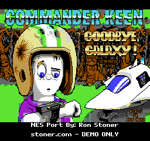
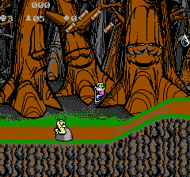
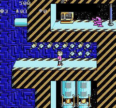
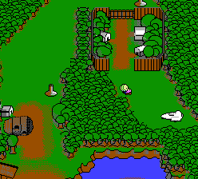

# keen-nes

<p align="center">
  
  
  
  
</p>

An NES port of id Software's *Commander Keen* Galaxy games (episodes 4, 5 and
6), plus the PC-side build pipeline that converts the original game's data into
NES-native ROMs. Targets the **MMC5** mapper (iNES mapper 5 / ExROM) for
near-lossless per-8×8 backgrounds, per-level sprite CHR banks, animated tiles,
and expansion audio.

## No assets included — bring your own game

**This repository contains no game assets.** Commander Keen and its data are
copyright © 1991 id Software. To build a ROM you supply your **own** copy of the
original DOS game files; the pipeline extracts and converts them locally at
build time.

The engine and tools are a clean-room reimplementation. File-format and
behavior knowledge comes from public documentation — the Keen ModdingWiki and,
as a behavioral reference, the [Omnispeak](https://github.com/sulix/omnispeak)
project. This project's code is MIT-licensed — see [LICENSE](LICENSE) and the 
[Credits](#credits) and [Legal & disclaimer](#legal--disclaimer) sections below.

## Prerequisites

1. **llvm-mos** — the 6502 C/asm toolchain, unpacked at `third_party/llvm-mos/`
   (the build calls `third_party/llvm-mos/bin/mos-nes-mmc3-clang`).
   Get a prebuilt SDK from https://github.com/llvm-mos/llvm-mos-sdk.
2. **Python venv** at `.venv/` with **pillow** and **py65**:
   ```sh
   python3 -m venv .venv
   .venv/bin/pip install pillow py65
   ```
3. **unlzexe** — a small DOS EXE decompressor. Place its source at
   `third_party/unlzexe/unlzexe.c`; the Makefile compiles it automatically.
4. **Your original game files** (see below).

## Your game files

The build needs the original game's **data files**, not just the EXE. The
simplest correct thing is to **extract your entire DOS game directory** into the
matching `original/` folder (git-ignored) — copy *everything*, so no required
file is missed:

| Episode | Extract your game into | Key files the build reads (case-insensitive) |
|---------|------------------------|----------------------------------------------|
| Keen 4  | `original/Commander_Keen_4/` | `KEEN4E.EXE`, `EGAGRAPH.CK4`, `GAMEMAPS.CK4`, `AUDIO.CK4` |
| Keen 5  | `original/Commander_Keen_5/` | `KEEN5E.EXE`, `EGAGRAPH.CK5`, `GAMEMAPS.CK5`, `AUDIO.CK5` |
| Keen 6  | `original/Commander_Keen_6/` | `keen6.exe`, `EGAGRAPH.CK6`, `GAMEMAPS.CK6`, `AUDIO.CK6` |

- The **`.EXE`** is LZEXE-compressed; the build unpacks it automatically (via
  `unlzexe`) to recover the embedded graphics/audio header tables.
- **`EGAGRAPH`** (tiles, sprites, bitmaps), **`GAMEMAPS`** (level maps), and
  **`AUDIO`** (music + sound) are read directly and are **required** — supplying
  only the EXE fails at the extract step with e.g. `egagraph.ck4 ... not found`.

The build then unpacks the EXE, extracts the embedded asset tables and archives,
and converts everything to NES formats under `assets/` and `src/gen/` (both
git-ignored).

## Building

```sh
make keen4        # -> build/keen4.nes
make keen5        # -> build/keen5.nes
make keen6        # -> build/keen6.nes
make episodes     # all three, in sequence (they share src/gen, so not parallel)
make hello_mmc5   # standalone MMC5 mapper proof ROM (no game assets needed)
make clean
```

Each episode target regenerates `src/gen/` for that episode before linking, so
build them one at a time (`make -j` across episodes is not supported).

## Repository layout

```
src/            NES engine — C + 6502 asm, MMC5 platform glue (src/mmc5/)
tools/          PC-side build pipeline (extract + convert + code generators)
Makefile        Build entry points
```

Generated and external directories (`assets/`, `src/gen/`, `build/`,
`original/`, `third_party/`, `.venv/`) are git-ignored and created on demand.

## Design tradeoffs

Deliberate scope decisions (not bugs — noted so contributors understand the
shape of the project):

- **MMC5 mapper.** Chosen for near-lossless per-8×8 backgrounds, per-level
  sprite CHR banks, and expansion audio — at the cost of requiring a larger,
  MMC5-capable cart/emulator rather than a plain NROM/MMC3 target.
- **Demo-scope level slice per episode.** Each episode ships a small set of
  levels bounded by the single-8 KB-bank metatile cap and CHR budget (see the
  Makefile comments). Extending coverage is a natural contribution.
- **Missing animations** Some animations may be missing as a design and 
  optimization tradeoff. 
  
## Roadmap to full Keen 4 / known limitations

The Keen 4 demo ships the **world map** plus **four playable stages** (ship,
Border Village, Slug Village, Perilous Pit) — not the full ~18-level episode.
The hard foundation work is done; extending coverage is mostly additive.
Effort tags: `S` small, `M` medium, `L` large. Contributions welcome.

**Foundation**

- **Raise the ~819-metatile-per-level cap** (`L`) — a level's metatile table
  currently must fit one 8 KB PRG bank (`src/seam_decode.s` reads records at
  `$8000 + m*8`). Bank-split it so the largest maps fit. Prereq for shipping all
  ~18 levels; the same move that earlier removed the 256-metatile cap.

**World map & level flow**

- **World-map mode** (`done`) — overworld is ROM slot `MAP_ROM_SLOT`
  (GAMEMAPS 0); map Keen walks with FG clip using dedicated 8-direction ×
  3-frame MapKeen sprites; A/B on `0xC0xx` enter tiles loads that level;
  completing a level marks it done, re-opens `0xD0xx` fences via cell
  overrides, plants a static flag on the `0xF0xx` holder, and returns to the
  saved map position. Score/lives/ammo/lifewater persist across levels. The
  ship (BWB Megarocket) is a playable, always re-enterable map node.
  Remaining polish: the flag-throw animation on level completion (flags
  currently appear planted, no arc), and map teleporters (Keen 5/6 only).
- **Full episode level set on the map** (`L`) — depends on the metatile-cap
  raise; the demo still packs only a small playable subset (see Makefile).

**Sages (Council Members)**

- **Council Member rescue actor** (`M`) — the `pl_quest` counter already exists
  in `src/player.c`; the NPC does not. Add the rescued-elder actor + animation.
- **Win condition + ending** (`S/M`) — all 8 rescued → end-of-game trigger and
  story/ending screens.

**Platforms & environment**

- **Moving / "surfing" platforms** (`M`) — data is already emitted (`plats` with
  a signed dir, `fplats`); finish the ride-on actor. (Supersedes the old
  "lifters need work" note.)
- **Gem/keygem doors + switches** (`done`) — gem holders consume the matching
  `pl_keys` gem and open the door via cell overrides; switches toggle on an
  Up-press; in-level door transitions fade Keen out and cut to the
  destination.

**Full bestiary**

- **Generalize the actor system** (`L`) — `src/actors.c` hardcodes three enemy
  slots per episode (`#if EPISODE`). Refactor to a type-tagged behavior table so
  enemies are pluggable and levels declare their own mix. Unblocks the below.
- **One enemy per contribution** (`M` each) — implemented so far: Poison Slug,
  Lick, Mad Mushroom, Skypest, Bounder, Wormouth, Mimrock. Remaining Keen 4
  bestiary: Dopefish, Arachnut, Berkeloid, Inchworm, Foot, Schoolfish, Sprite,
  Lindsey, … The per-level sprite-CHR-bank design already scopes art to the
  enemies a level actually uses, so this parallelizes cleanly.

**Juice & polish**

- **Player idle animations** (`S`) — idle blink/foot-tap. (LOOKU/LOOKD/DEATH
  poses are wired: look up/down pans the camera, and the death arc plays with
  its own art.)
- **More background effects** (`S/M`) — additional TILEINFO anim chains; swim /
  wetsuit (untested); pole-climb polish.
- **Palette bugs** (`M`) — some converted palettes render incorrectly
  (`tools/convert_nes.py`, `tools/gen_mmc5_level.py`).
- **Keen 6 extraction** (`M`) — Keen 6 data differs from Keen 4/5
  (format/asset-table differences) and needs episode-6-specific handling; its
  Bloogwaters level (923 MTs) also needs the cap raise above.
- **Remove remaining PC-era idioms** (`S`) — the port still carries DOS 16-bit
  assumptions in places that should be 8-bit on the 6502.

**Critical path:** cap raise → more levels on the map → Council Members +
ending yields a structurally complete game loop (map → levels → rescue → win)
even before the full bestiary; then the actor-system refactor and per-enemy work
is the long tail a community chews through in parallel.

## Contributing

The demo scope is a small slice of levels per episode (see the comments in the
Makefile for the metatile/CHR budget). The pipeline is episode-aware via the
`KEEN_EP` environment variable. Contributions that extend level coverage, tune
the converters, or improve the engine are welcome — just never commit game
assets or files derived from them.

## License

The code is licensed under the **MIT License** — see [LICENSE](LICENSE). The
MIT grant covers this project's original source and tools only; it conveys no
rights to *Commander Keen* itself (see below).

## Credits

- **Original game:** *Commander Keen in Goodbye, Galaxy* (Keen 4) by id
  Software; original publisher Apogee Software. (The build pipeline also
  supports Keen 5 and 6 from your own copies.)
- **Reference implementation:** [Omnispeak](https://github.com/sulix/omnispeak)
  by sulix, NY00123, and lemm — used as a behavioral reference only.
- **NES port and all new code:** Ron Stoner.

## Legal & disclaimer

This is a non-commercial, fan-made technical demo. It is **not** affiliated
with, endorsed by, or sponsored by id Software, Bethesda Softworks, ZeniMax
Media, or Apogee Software.

The distributed tech demo is a Keen 4 ROM with the overworld and a four-level
playable slice, for technical-demonstration and preservation purposes only —
it is not a full game.

The MIT license applies **only** to this project's original source code and
tools. It grants **no** rights to *Commander Keen* — the characters, gameplay,
story, artwork, music, level data, and all other assets remain the copyrights
and trademarks of their respective owners (id Software / ZeniMax / Bethesda).
This project includes and distributes **no** original game assets or data
files; you must own the original games to build a ROM.

Because a built ROM embeds id's copyrighted assets, distributing or selling
such ROMs or physical cartridges may infringe those copyrights regardless of
this code's MIT license. The MIT grant covers the code only — it is not
permission to distribute id's assets, and I do not support commercial sale of
ROMs or cartridges built from this project.
